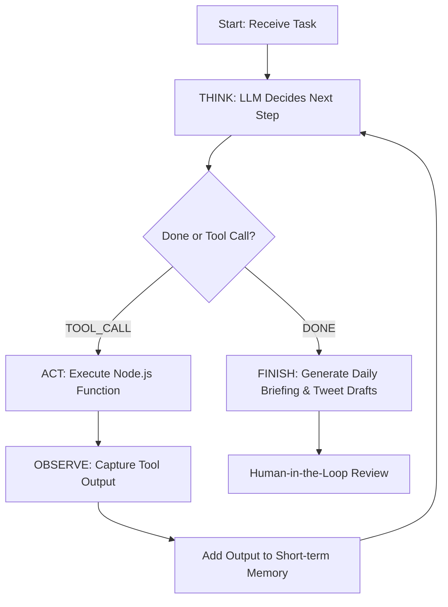

# 🧠 learn-in-public-agent

An autonomous research and content-drafting AI agent built completely from scratch in Node.js. Zero frameworks, zero dependencies. 

Designed to automate the grunt work of a "Learn in Public" creator by researching daily tech trends on Hacker News/Reddit and generating punchy, high-engagement tweet drafts.

---

## 🚀 How It Works: The Think → Act → Observe Loop

Every modern agent framework (LangGraph, CrewAI, AutoGen) runs on a simple, recursive loop. This repository implements that primitive loop manually in under 150 lines of pure JavaScript:



1. **THINK:** The LLM receives the task, tool descriptions, and past memory, then decides what to do next.
2. **ACT:** The engine executes the tool function chosen by the LLM (e.g., fetching APIs).
3. **OBSERVE:** The output of the tool is fed back into the LLM's context window.
4. **REPEAT:** The loop continues recursively until the LLM decides it has enough information to draft the content.

---

## ⚡ Features

- **Zero-Dependency Core:** Powered entirely by native Node.js (`fetch`, `fs`, `path`). No framework bloat.
- **Hybrid LLM Provider:** Iterates locally using Ollama (`Phi-4 Mini` / `Llama 3.2`) and falls back to `Gemini 2.5 Flash` API (free tier) for high-fidelity writing.
- **Contextual Memory:**
  - **Anti-Repetition:** Remembers previously covered topics across runs.
  - **Account Stage Awareness:** Dynamically adapts its writing style based on account maturity (`launch` -> `ramping` -> `active`).
- **Targeted Tools:** Native connectors for Hacker News API and Reddit JSON endpoints.

---

## 📦 Project Structure

```
.
├── src/
│   ├── agent.js       # Core Think-Act-Observe loop (~160 lines)
│   ├── tools.js       # HN & Reddit API tools (~150 lines)
│   ├── llm.js         # Gemini & Ollama integration (~130 lines)
│   └── memory.js      # Long-term JSON-based memory (~120 lines)
├── output/            # Generated daily briefings (gitignored)
├── .env.example       # Environment template
└── package.json       # ES modules & run scripts
```

---

## 🛠️ Quick Start

### 1. Prerequisites
- Node.js (v22.0.0 or higher)

### 2. Installation & Setup
Clone the repository and install the initial package configuration:
```bash
git clone https://github.com/YOUR_USERNAME/learn-in-public-agent.git
cd learn-in-public-agent
npm install
```

### 3. Configure Secrets
Create a `.env` file in the root directory:
```env
# Choose provider: "gemini" (default) or "ollama"
LLM_PROVIDER=gemini

# Get your free Gemini API key at: https://aistudio.google.com/apikey
GEMINI_API_KEY=your_key_here
```

### 4. Run the Agent
Run the full autonomous loop to generate today's briefing:
```bash
npm run agent
```

Your briefing and drafted tweets will be saved as a timestamped markdown file inside `/output/` for you to review, edit, and post!

---

## 🧪 Educational Value

This repository was built live as part of a **Learn in Public** initiative. It serves as a proof of concept showing that:
1. AI agents don't require complex abstractions or heavy Python packages.
2. The core value of an agent lies in **strict prompt engineering** and **clean tool contracts**.
3. Human-in-the-loop validation is non-negotiable for fact-checking AI drafts (avoiding hallucinated acronyms!).

---

## 📝 License

This project is open-source and available under the [MIT License](LICENSE).

---

> Follow the build journey on X: **[@BuildWithFaizan](https://x.com/BuildWithFaizan)** 🔨
